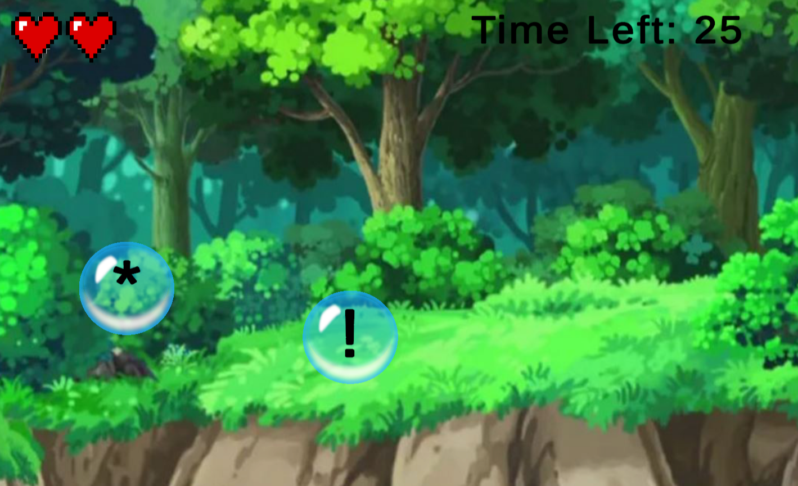

# Letter Recognition Prototype

A prototype for an educational children's game designed to teach the basics of the english language. Here, players learn how to distinguish letters of the alphabet from other symbols.

The game can be played here: https://couinex.itch.io/letter-recognition-prototype